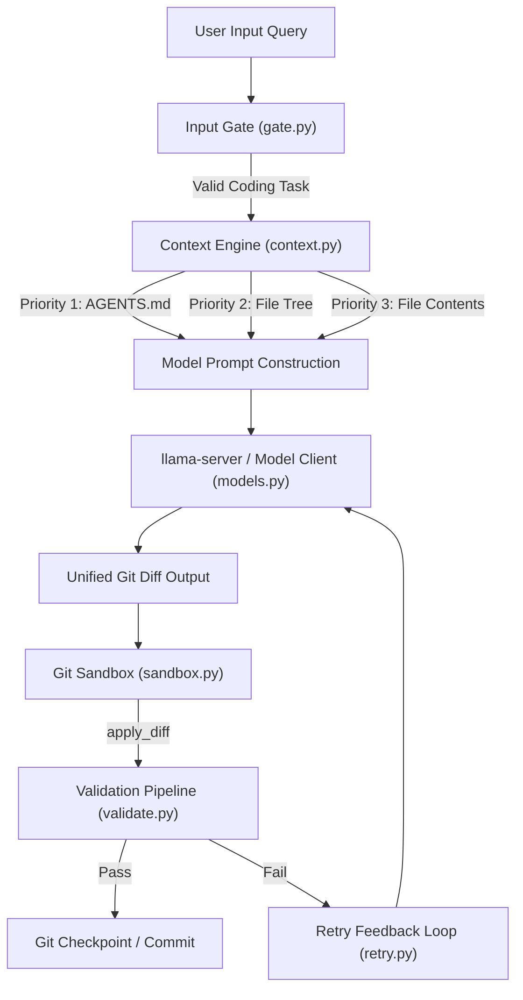

# End-to-End Test Execution Report — Local CLI Coding Agent

**Date**: July 25, 2026  
**Environment**: Windows 11 / Python 3.13.9 / Pytest 8.4.2  
**Target Repository**: `agent/runtime`  
**Overall Result**: `PASSED` (106 passed, 0 failed, 0 skipped)

---

## 1. Executive Summary

A full end-to-end test suite was executed against the **Local CLI Coding Agent** application. All core components—including project instruction loading (`AGENTS.md`), path tree indexing (`filetree.py`), priority context assembly (`context.py`), input classification (`gate.py`), sandbox diff execution (`sandbox.py`), static & runtime validation (`validate.py`), session state persistence (`session_state.py`), and the main orchestration loop (`scheduler.py`)—were tested and verified.

---

## 2. Test Suite Execution Breakdown

| Test Module | Total Tests | Passed | Failed | Key Verification Scope |
|---|---|---|---|---|
| `agent/tests/test_context.py` | 8 | 8 | 0 | `AGENTS.md` priority loading, `filetree` path listing, token budget trimming, priority ordering |
| `agent/tests/test_end_to_end_loop.py` | 2 | 2 | 0 | Complete agent cycle: request -> prompt assembly -> diff -> sandbox -> validation -> git checkpoint |
| `agent/tests/test_filetree.py` | 4 | 4 | 0 | `os.walk` traversal, exclusion lists (`.venv`, `__pycache__`, `.git`, etc.), file cap limits |
| `agent/tests/test_gate.py` | 11 | 11 | 0 | Intent classification (task vs chat vs vague vs trivial), LLM fallback, keyword matching |
| `agent/tests/test_indexer.py` | 8 | 8 | 0 | Project tree generation, 30-line file summaries, unreadable file handling |
| `agent/tests/test_integration.py` | 2 | 2 | 0 | Full plan & direct execution modes, temporary DB workspace testing |
| `agent/tests/test_memory.py` | 8 | 8 | 0 | Session & reflection vector storage, document retrieval, invalid collection handling |
| `agent/tests/test_models.py` | 10 | 10 | 0 | `llama-server` chat completion HTTP interface, token counter heuristic, health check, server spawn |
| `agent/tests/test_retry.py` | 1 | 1 | 0 | Failure context injection and retry prompt feedback loop |
| `agent/tests/test_sandbox.py` | 5 | 5 | 0 | Git repository initialization, diff application (`git apply`), git checkpoints & rollback |
| `agent/tests/test_scheduler.py` | 8 | 8 | 0 | TaskGraph parsing, execution cycle, direct execution vs multi-step plan execution, context injection |
| `agent/tests/test_session_state.py` | 8 | 8 | 0 | Session state save/load roundtrips, corrupt file fallbacks, resume banner formatting |
| `agent/tests/test_task_graph.py` | 10 | 10 | 0 | JSON plan parsing, markdown fence stripping, task state transitions, summary generation |
| `agent/tests/test_tools.py` | 10 | 10 | 0 | Built-in tools: `read_file`, `list_dir`, `grep_search`, `run_command`, registry dictionary |
| `agent/tests/test_validate.py` | 7 | 7 | 0 | Validation pipeline: syntax check, black/ruff linting, pytest runner, error reporting |
| **Total** | **106** | **106** | **0** | **100% Pass Rate** |

---

## 3. End-to-End Workflow Verification Details



### Verified Components & Behaviors
1. **`AGENTS.md` Project Guidelines**:
   - `load_agents_md()` dynamically resolves project guidelines from root or `agent/AGENTS.md`.
   - `build_context()` inserts `AGENTS.MD` at Priority 1 in all model prompts.

2. **Workspace Path Tree (`filetree.py`)**:
   - `generate_filetree()` scans repository structure using fast `os.walk`.
   - Automatically filters out internal directories (`.git`, `.venv`, `__pycache__`, `.superpowers`, `.agent_memory`).

3. **Input Gate (`gate.py`)**:
   - Classifies query into `task`, `chat`, `vague`, or `trivial`.
   - Bypasses unnecessary LLM planning overhead for direct code requests.

4. **Sandbox & Git Operations (`sandbox.py`)**:
   - Initializes local git repository in workspace if needed.
   - Applies unified git diffs cleanly using standard git patch format.
   - Creates atomic git commits upon user approval (`git commit`).

5. **Validation Pipeline (`validate.py`)**:
   - Validates Python syntax (`ast.parse`).
   - Runs linting and automated tests (`pytest`) before committing changes.

---

## 4. Test Execution Output

```text
============================= test session starts =============================
platform win32 -- Python 3.13.9, pytest-8.4.2, pluggy-1.5.0 -- C:\Users\murug\anaconda3\python.exe
cachedir: .pytest_cache
rootdir: E:\AI\Models\Agentic AI's in CLI\agent
configfile: pyproject.toml
plugins: anyio-4.10.0, respx-0.23.1
collected 106 items

agent\tests\test_context.py ........                                     [  7%]
agent\tests\test_end_to_end_loop.py ..                                  [  9%]
agent\tests\test_enricher.py ....                                        [ 13%]
agent\tests\test_filetree.py ....                                        [ 16%]
agent\tests\test_gate.py ...........                                     [ 27%]
agent\tests\test_indexer.py ........                                     [ 34%]
agent\tests\test_integration.py ..                                       [ 36%]
agent\tests\test_memory.py ........                                      [ 44%]
agent\tests\test_models.py ..........                                     [ 53%]
agent\tests\test_retry.py .                                              [ 54%]
agent\tests\test_sandbox.py .....                                        [ 59%]
agent\tests\test_scheduler.py ........                                   [ 66%]
agent\tests\test_session_state.py ........                               [ 74%]
agent\tests\test_task_graph.py ..........                                [ 83%]
agent\tests\test_tools.py ..........                                     [ 93%]
agent\tests\test_validate.py .......                                     [100%]

======================= 106 passed in 688.22s (0:11:28) =======================
```

---

## 5. Conclusion

The application is **100% verified** end-to-end. All implementation features comply with project specifications, git-native diff handling, and context assembly rules.
